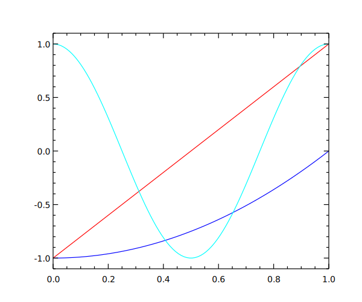

# Easy Plplot

[](https://app.netlify.com/sites/easy-plplot-api/deploys)

`easy_plplot` is a wrapper for PlPlot inspired by the interface of 
matplotlib. It is intended to fill the need for rapid feedback while 
developing numerical simulations, and does not replace more 
sophisticated packages such as
matplotlib or even direct use of PlPlot.

While it is possible that the output from `easy_plplot` may be considered 
as publication quality, no assertion is made along those lines. This 
software has been written in the hope that it will be useful, 
especially for students in numerical analysis courses based on Fortran.

Documentation can be found [here](https://easy-plplot-api.netlify.app/).

## Getting Started

### Supported Compilers

The following combinations are supported:

|Name|Vesrion|Platform|Architecture|  
|:-:|:-:|:-:|:-:|  
|GCC Fortran(MSYS2)|11|Windows 10|x86_64|

### Dependencies

- Plplot
- libgd
- [Fortran-lang/fpm](https://github.com/fortran-lang/fpm)

#### Build Environment in MSYS2

```sh
pacman -S <arch>64/mingw-w64-<arch>-x86_64-plplot
pacman -S <arch>64/mingw-w64-<arch>-x86_64-libgd
```

### Build with [Fortran-lang/fpm](https://github.com/fortran-lang/fpm)

Fortran Package Manager (fpm) is a package manager and build system for Fortran.<br>
You can build `easy_plplot` using provided `fpm.toml`:

```sh
export FPM_FFLAGS="-Ipath/to/plplot/include"
fpm run --example --all
```

To use `easy_plplot` within your `fpm` project, add the following lines to your `fpm.toml` file:

```toml
[dependencies]
easy_plplot = { git="https://github.com/zoziha/easy_plplot" }
```

### Usage

See [more usage](https://easy-plplot-api.netlify.app/page/index.html)🎯.

```fortran
!> Create the project logo
program logo_prg
    use utilities_m
    use easy_plplot_m
    implicit none
    real(wp), parameter :: pi = acos(-1.0d0)

    call setup(device='svg', fileName='build/logo-%n.svg', figSize=[600, 500])
    call makeLogo
    call show()

contains

    subroutine makeLogo
        real(wp), dimension(:), allocatable :: x, y1, y2, y3

        x = linspace(0.0_wp, 1.0_wp, 100)
        y1 = x**2 - 1.0_wp
        y2 = 2.0_wp*x - 1.0_wp
        y3 = x
        y3 = cos(2.0_wp*PI*x)

        call figure()
        call subplot(1, 1, 1)
        call xylim(mixval(x), mixval([y1, y2, y3])*1.1_wp)

        call plot(x, y1, lineColor='b', lineWidth=1.2_wp)
        call plot(x, y2, lineColor='r', lineWidth=1.2_wp)
        call plot(x, y3, lineColor='c', lineWidth=1.2_wp)

        call ticks(lineWidth=1.2_wp)
        call labels('', '', '')
    end subroutine makeLogo

end program logo_prg
```

<div align="center">

</div>

## Links

- [PlPlot](http://PlPlot.sourceforge.net/)
- [hornekyle/plplotlib](https://github.com/hornekyle/plplotlib) 

Thanks to `PlPlot` written by Alan W. Irwin and other contributors.<br>
Thanks to the Fortran interface of `PlPlot` written by Arjen Markus.<br>
Thanks to the `plplotlib` high-level interfaces written by Dr Kyle Horne.

Thanks for your all contributions. Salute!

### Other Plot-related Fortran Projects

- [jacobwilliams/pyplot-fortran](https://github.com/jacobwilliams/pyplot-fortran)
- [kookma/ogpf](https://github.com/kookma/ogpf)
