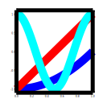

# PlPlotLib

<div align="center">

</div>

PlPlotLib is a wrapper for PlPlot inspired by the interface of 
matplotlib. It is intended to fill the need for rapid feedback while 
developing numerical simulations, and does not replace more 
sophisticated packages such as
matplotlib or even direct use of PlPlot.

While it is possible that the output from PlPlotLib may be considered 
as publication quality, no assertion is made along those lines. This 
software has been written in the hope that it will be useful, 
especially for students in numerical analysis courses based on Fortran.

Documentation can be found [here](http://hornekyle.github.io/PlPlotLib).

## Get Started

### Supported Compilers

The following combinations are supported:

|Name|Vesrion|Platform|Architecture|  
|:-:|:-:|:-:|:-:|  
|GCC Fortran(MSYS2)|11|Windows 10|x86_64|

### Dependencies

- PlPlot
- libgd
- [Fortran-lang/FPM](https://github.com/fortran-lang/fpm)

#### Build Environment in MSYS2

```sh
pacman -S ucrt64/mingw-w64-ucrt-x86_64-PlPlot
pacman -S ucrt64/mingw-w64-ucrt-x86_64-libgd
```

### Build with FPM

Fortran Package Manager (fpm) is a package manager and build system for Fortran.<br>
You can build `PlPlotLib` using provided `fpm.toml`:

```sh
fpm run --list
fpm run <executable_name, see `fpm.toml` or run list>
```

To use `PlPlotLib` within your `fpm` project, add the following lines to your `fpm.toml` file:

```toml
[dependencies]
PlPlotLib = { git="https://github.com/zoziha/PlPlotLib" }
```

### Usage

```fortran
program logo_prg
        !! Create the project logo
    use kinds_mod
    use utilities_mod
    use PlPlotlib_mod
    implicit none

    call setup(device='svg', fileName='build/logo-%n.svg', figSize=[600, 500])
    call makeLogo
    call show()

contains

    subroutine makeLogo
        real(wp), dimension(:), allocatable :: x, y1, y2, y3

        x = linspace(0.0_wp, 1.0_wp, 100)
        y1 = x**2 - 1.0_wp
        y2 = 2.0_wp*x - 1.0_wp
        y3 = x
        y3 = cos(2.0_wp*PI*x)

        call figure()
        call subplot(1, 1, 1)
        call xylim(mixval(x), mixval([y1, y2, y3])*1.1_wp)

        call plot(x, y1, lineColor='b', lineWidth=1.2_wp)
        call plot(x, y2, lineColor='r', lineWidth=1.2_wp)
        call plot(x, y3, lineColor='c', lineWidth=1.2_wp)

        call ticks(lineWidth=1.2_wp)
        call labels('', '', '')
    end subroutine makeLogo

end program logo_prg
```

<div align="center">

</div>

## Links

- [PlPlot](http://PlPlot.sourceforge.net/)
- [hornekyle/PlPlotLib](https://github.com/hornekyle/PlPlotLib) 

Thanks to `PlPlot` written by Alan W. Irwin and other contributors.<br>
Thanks to the Fortran interface of `PlPlot` written by Arjen Markus.<br>
Thanks to the `PlPlotLib` high-level interfaces written by Dr Kyle Horne.

Thanks for your all contributions. Salute!